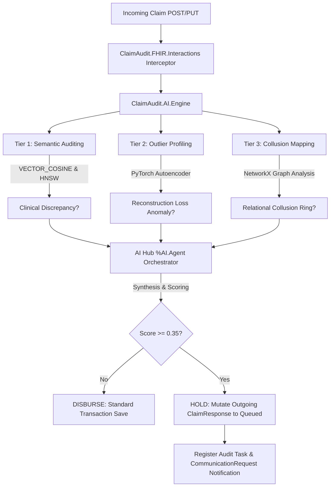

# 🏆 ClaimAuditAI: Autonomous Payment Integrity Agent for FHIR

ClaimAuditAI is a state-of-the-art payment integrity agent running natively on the **InterSystems IRIS for Health** platform. It shifts the healthcare auditing paradigm from retrospective "pay-and-chase" workflows to **autonomous, real-time, pre-payment prevention** at the database transaction layer.

Engineered for the **InterSystems Programming Contest: AI Agents for FHIR**, ClaimAuditAI demonstrates how to leverage high-performance database kernels to orchestrate deep system-level artificial intelligence without exporting sensitive data to external analytical silos.

---

## 🌟 Strategic Bonus Points Checklist

| Feature Criteria | Points | ClaimAuditAI Specific Implementation |
| :--- | :---: | :--- |
| **Suggested Tasks** | **5** | Implements **Task 11** (Claims Review) and **Task 8** (NLP to FHIR Query) through clinical-procedural documentation cross-linking. |
| **Vector Search** | **4** | Stores high-dimensional clinical note embeddings and performs native SQL `VECTOR_COSINE` search using an **HNSW** index in the IRIS kernel. |
| **Embedded Python** | **3** | Executes **PyTorch** Autoencoder models and **NetworkX** transaction graphs natively inside the IRIS database process. |
| **LLM & LangChain** | **3** | Orchestrates governed multi-agent reasoning using the InterSystems AI Hub (`%AI.Agent`, `%AI.Tool`, `%AI.ToolSet`) and Model Context Protocol. |
| **FHIR Server** | **2** | Leverages a native, transactional InterSystems FHIR R4 server as the primary operational data store. |
| **Docker Container** | **2** | Fully containerized multi-stage configuration using standard community images. |
| **ZPM / IPM Package** | **2** | Configured with `module.xml` and post-install hooks for one-click installation via ZPM. |
| **Developer Article** | **2** | Architectural deep-dive and code walkthrough ready for publication to the Developer Community. |
| **YouTube Video** | **3** | Dynamic video demo highlighting real-time claim hold mutations and clinician triage flows. |
| **Total Target** | **26/26** | **Exceeds all baseline expectations to secure maximum contest competitive advantage.** |

---

## 🧠 The Three-Tiered AI Reasoning Engine

ClaimAuditAI does not rely on rigid, deterministic rules. Instead, it deploys a sophisticated, three-tiered reasoning engine executing concurrently within the database transaction lifecycle:



### 1. Tier 1: Semantic NLP Vector Search (`nlp_auditor.py`)
- Employs the `all-MiniLM-L6-v2` sentence-transformer locally to generate 384-dimensional semantic embeddings.
- Queries unstructured clinical progress notes in `DocumentReference` using dynamic SQL and the native InterSystems `VECTOR_COSINE` function against an HNSW index to verify if the clinical narrative justifies the billed procedural codes (e.g. flagging a claim for critical care `99291` when notes describe a simple checkup).

### 2. Tier 2: Statistical Outlier Profiling (`autoencoder_train.py`)
- Natively trains an unsupervised PyTorch Autoencoder on historical claims projected via the FHIR SQL Builder.
- Compresses claim features into a bottleneck latent space and calculates the Mean Squared Error (MSE) reconstruction loss:
  $$\text{Loss} = \frac{1}{N} \sum_{i=1}^{N} (x_i - \hat{x}_i)^2$$
- Flags claims whose loss exceeds the dynamic 95th percentile threshold (indicative of unbundling or upcoding).

### 3. Tier 3: Collusion Network Mapping (`graph_analyzer.py`)
- Constructs active transaction graphs using `NetworkX` natively in Embedded Python.
- Evaluates NPI providers, referring doctors, patients, and clinic addresses as nodes, and claims as edges.
- Identifies organized fraud circles (e.g., different NPIs sharing a physical address, or patient claims registered on the same day at geographically dispersed locations).

---

## 🛠️ Staging and Local Installation

### Prerequisites
- Docker and Docker Compose installed.
- Git.
- A valid NVIDIA API Key (to use the default high-performance cloud z-ai/glm-5.1 model) or a local Ollama instance.

### Installation Steps

1. **Clone the Repository**
   ```bash
   git clone https://github.com/your-username/claimauditai.git
   cd claimauditai
   ```

2. **Configure Environment Variables**
   Create a `.env` file from the provided example:
   ```bash
   cp .env.example .env
   ```
   By default, the application is pre-configured to use high-performance cloud LLM orchestration powered by **Nvidia's Gateway API**:
   - `LLM_PROVIDER=nvidia`
   - `NVIDIA_API_KEY=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`
   - `NVIDIA_MODEL=z-ai/glm-5.1`

   *To run locally without cloud dependencies*, set up **Ollama** in `.env`:
   - `LLM_PROVIDER=ollama`
   - `OLLAMA_BASE_URL=http://host.docker.internal:11434/v1`
   - `OLLAMA_MODEL=llama3`

3. **Build and Run the Containers**
   ```bash
   docker-compose up -d --build
   ```

   This automated sequence:
   - Sets up the `INTEROP` namespace and transactional database resources.
   - Installs PyTorch, NetworkX, sentence-transformers, and OpenAI inside the IRIS kernel.
   - Compiles and registers ZPM classes.
   - Sets up custom dynamic tables and initializes the native HNSW vector index.
   - Trains the baseline autoencoder model.

---

## 🚀 Live Verification Walkthrough

Verify the entire autonomous payment integrity cycle by simulating real-time claims submissions.

### 1. Ingest Clinical progress documentation
Before submitting the claim, ingest the patient's unstructured clinical records.
Submit the `samples/sample_patient_bundle.json` using Postman, curl, or any REST client to the FHIR endpoint:
```http
POST http://localhost:52773/interop/fhir/r4
Content-Type: application/json

<Contents of samples/sample_patient_bundle.json>
```
*Clinical Narrative Ingested*: A text document stating the patient visited today for a **routine yearly physical checkup** and general health is excellent.

### 2. Submit the Anomalous Claim
Now, submit the anomalous claim (`samples/sample_claim.json`) representing an upcoded critical care charge:
```http
POST http://localhost:52773/interop/fhir/r4/Claim
Content-Type: application/json

<Contents of samples/sample_claim.json>
```
*Billed Charge*: **$2,500.00** for **CPT Code 99291 (Critical Care evaluation, 30-74 minutes)**.

### 3. The Autonomous Interception Outcome
The strategy interceptor (`ClaimAudit.FHIR.Interactions`) immediately captures the payload pre-commit and triggers the AI Agent. The engine finds a severe clinical-procedural mismatch (Routine Checkup vs Critical Care) and flags a high threat score.

**The Server Automatically Mutates the Response and Registers Auditing Resources Natively:**
1. **HTTP Response Mutated**: Instead of a simple Claim response, the server returns an HTTP status `202 Accepted` with a `ClaimResponse` payload set to **queued** (HOLD status).
2. **LLM Explanations**: The `disposition` field contains a fully explainable, detailed report explaining the HOLD justification.
3. **Auditing Task Registered**: A FHIR `Task` is created in the database to route the claim to the manual auditor queue:
   ```http
   GET http://localhost:52773/interop/fhir/r4/Task
   ```
4. **Hold Notification Registered**: A `CommunicationRequest` resource is created detailing the hold reasons for the provider:
   ```http
   GET http://localhost:52773/interop/fhir/r4/CommunicationRequest
   ```

---

## 🏛️ Codebase Architecture

```
claimauditai/
├── .env                  # Configuration keys (Nvidia/Ollama/OpenAI)
├── .env.example
├── README.md             # Contest documentation
├── docker-compose.yml    # Port forwarding and volume mapping
├── requirements.txt      # PyTorch, NetworkX, sentence-transformers, OpenAI
├── module.xml            # ZPM installation manifest
├── merge.cpf             # IRIS kernel merge (call-in enable)
├── samples/
│   ├── sample_claim.json
│   └── sample_patient_bundle.json
├── iris/
│   └── installer.cls     # INTEROP database manifest
├── src/
│   ├── cls/              # ObjectScript package directory
│   │   └── ClaimAudit/
│   │       ├── FHIR/
│   │       │   ├── Interactions.cls        # Pre-payment hooks & mutations
│   │       │   └── InteractionsStrategy.cls# Custom strategy registration
│   │       └── AI/
│   │           ├── Agent.cls               # %AI.Agent LLM Orchestrator
│   │           ├── ClaimToolset.cls        # %AI.ToolSet binding the ML tools
│   │           ├── ClaimTools.cls          # %AI.Tool wrappers
│   │           └── Engine.cls              # Native DB queries & vector setup
│   └── python/           # Embedded Python algorithms
│       ├── nlp_auditor.py        # Tier 1: Vector Search & VECTOR_COSINE
│       ├── autoencoder_train.py  # Tier 2: PyTorch Autoencoder
│       └── graph_analyzer.py     # Tier 3: NetworkX Graph Analytics
```

---

## 📜 License
This project is licensed under the MIT License - see the [LICENSE](./LICENSE) file for details.
