# ClaimAuditAI

An autonomous, pre-payment payment integrity agent running natively on InterSystems IRIS for Health. ClaimAuditAI intercepts FHIR Claim submissions in the request lifecycle, analyzes them through a three-tier AI reasoning engine, and holds suspicious transactions for human review.

**Author:** Mainza Kangombe — [LinkedIn](https://www.linkedin.com/in/mainza-kangombe-6214295/)

<p align="center">
  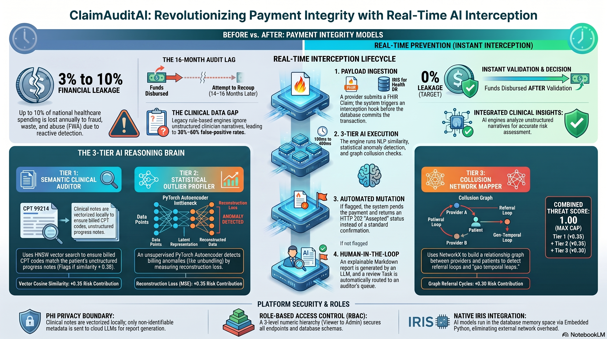
</p>

---

## 🎥 Product Videos

Learn more about the business motivation and technical architecture of ClaimAuditAI:

<p align="center">
  <a href="https://youtu.be/0H-5j5jr43A">
    
  </a>
  &nbsp;&nbsp;&nbsp;&nbsp;
  <a href="https://youtu.be/5Za-2dKTQzY">
    
  </a>
</p>

* **[ClaimAuditAI - Video Explainer](https://youtu.be/0H-5j5jr43A):** A high-level overview of healthcare payment integrity challenges and how ClaimAuditAI intercepts anomalous claims.
* **[ClaimAuditAI - Video Walkthrough Demo](https://youtu.be/5Za-2dKTQzY):** A detailed developer walkthrough covering FHIR endpoints, the 3-Tier AI Engine, Cytoscape network graphs, and role-based access.

---

## 🌟 Key Capabilities

<p align="center">
  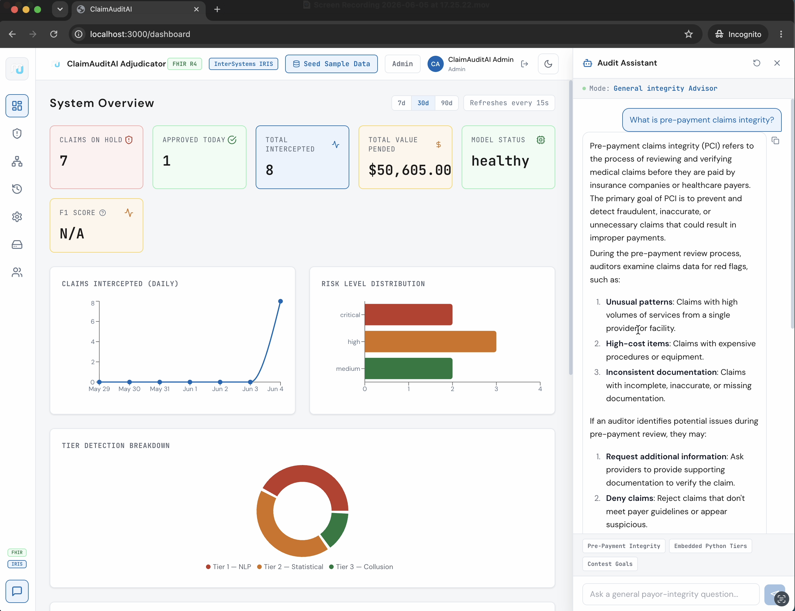
</p>


- **Real-Time FHIR Interception:** Claims are audited, pended, and held at the database/middleware layer before persistence, fully supporting both single Claims and batch/transaction Bundles.
- **Asynchronous Background Processing Queue:** Defer slow AI pipelines (such as LLM generation and vector lookups) to an asynchronous database queue (`ClaimAudit.Data.Queue`). Returns a fast `202 Accepted` to clients in milliseconds, while a background worker process runs the full FSM.
- **Three-Tier AI Engine:** Runs HNSW clinical note NLP vector search, PyTorch reconstruction loss anomaly profiling, and NetworkX collusion cycle graph analysis sequentially under strict timeout and circuit-breaker safeguards. The circuit breaker (default: 3 failures → 60s cooldown) halts tier execution to prevent cascading failures, with per-tier timeouts of 180s / 120s / 120s.
- **Atomic Transaction Integrity:** Native FHIR transaction Bundles create hold `ClaimResponse` records, review `Task` resources, and provider `CommunicationRequest` notifications atomically.
- **Federated Security & Role Hierarchy:** Authenticates via SMART on FHIR HS256 JWT tokens, validated against HMAC credential hashes stored in INTEROP globals — no `%SYS` namespace access required. Supports Keycloak RS256 JWKS for federated OIDC. Numeric role hierarchy (Viewer→Auditor→Specialist→Director→Admin) gates all protected endpoints.
- **Persistent Chat History:** Persists LLM assistant auditor conversation histories natively in IRIS via `ClaimAudit.Data.ChatHistory`, using escaped delimited SQL identifiers to avoid reserved keyword conflicts. The chat assistant uses **SSE streaming** — `llm_router.chat_stream()` yields token chunks from OpenAI-compatible providers, buffered by the ObjectScript endpoint into 80-character SSE `data:` lines for real-time UI display.
- **Tamper-Proof Audit Ledger:** High-precision subscript records (`^ClaimAuditLedger`) provide a reliable, date-indexed audit trail of override decisions, capturing human override rationales chronologically.
- **Interactive Localized Collusion Graphs:** Visualizes patient-provider relationship networks using Cytoscape.js via `ClaimAudit.Data.GraphStore`, which persists the provider-patient network in `^ClaimAuditGraph` globals and auto-detects address collisions. Queries are localized to 2-hop ego-networks via fast SQL selections to ensure high performance and scalability.
- **Direct Stats FHIR Extension Extraction:** Dashboard statistics are calculated by parsing the structured `tier-results` FHIR extension directly from `ClaimResponse` resources instead of relying on brittle disposition text substrings.
- **Comprehensive Patient & Provider Cards:** Exposes provider names, addresses, and patient details retrieved from SQL projections and raw FHIR resources on the auditor review pages.
- **Model Context Protocol (MCP) Terminology Server:** Exposes standard FastMCP-compliant tools for CPT and ICD-10 medical code lookups and diagnosis-procedure validation.
- **Explainable AI (XAI) Resource Citations:** Flagged results trace back dynamically to specific source FHIR resource IDs (e.g., `Patient/claimaudit-pat`, `DocumentReference/claimaudit-docref1`, or `Claim/claimaudit-claim1`), providing auditable trace evidence for human reviewers.
- **FHIR SQL Builder Projections:** Maps complex, nested FHIR JSON resource models into flat, relational SQL tables (e.g., `FHIRSQL.Claim` and `FHIRSQL.ClaimResponse`) under the `FHIRSQL` schema, using pre-configured mappings (`fhirsql/projections.json`) and a dedicated ObjectScript helper (`ClaimAudit.FHIR.SQLBuilderHelper`).

---

## 🏗 System Architecture

ClaimAuditAI integrates InterSystems IRIS for Health with an Embedded Python runtime and a React/TypeScript frontend (React 19, Vite, TanStack Query, Zustand, Cytoscape.js, Tailwind CSS).

```
       [ Submitted Claim ]
               │
               ▼
┌──────────────────────────────┐
│  InterSystems IRIS FHIR App  │
│  (FHIR Interceptor Hooks)    │
└──────────────┬───────────────┘
               │ (Atomic Transaction Bundle)
               ▼
┌──────────────────────────────┐
│      tier_orchestrator       │
│  (Sequential Engine Runner)   │
└──────┬───────┬───────┬───────┘
       │       │       │
       │       │       └─────────────────────────────┐
       ▼ (Timeout & Circuit Breaker)                 ▼
┌──────────────┐       ┌──────────────┐       ┌──────────────┐
│  Tier 1: NLP │       │  Tier 2: ML  │       │Tier 3: Graph │
│ (HNSW Vector │       │ (PyTorch AE  │       │ (NetworkX    │
│  Similarity) │       │ Anomaly Loss)│       │  Collusion)  │
└──────────────┘       └──────────────┘       └──────────────┘
```

### 1. The Interception Hook (`OnBeforeRequest` & `OnAfterRequest`)
The [Interactions.cls](src/cls/ClaimAudit/FHIR/Interactions.cls) class intercepts incoming requests for single `Claim` submissions or batch `Bundle` submissions. If a claim is flagged by the three-tier AI reasoning engine:
1. The interceptor temporarily intercepts standard storage persistence.
2. It aggregates holds and compiles an atomic FHIR `transaction` Bundle to write:
   - A `ClaimResponse` with `outcome` set to `queued` (HOLD status) and custom billing code/threat level extensions.
   - A manual audit `Task` routed to the practitioner queue.
   - A `CommunicationRequest` hold notification.
3. The response payload is mutated to return HTTP `202 Accepted` alongside the created hold `ClaimResponse` resource.

<p align="center">
  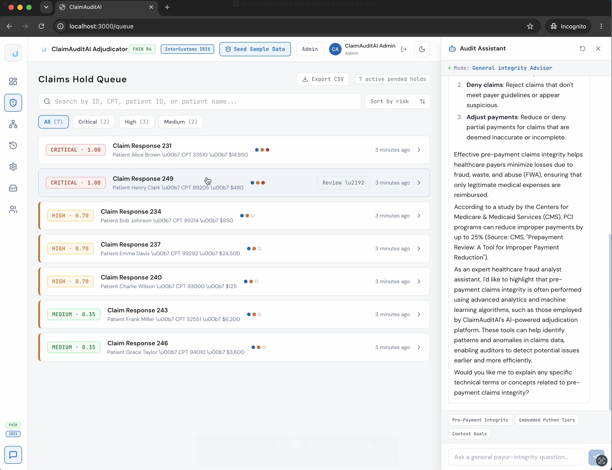
  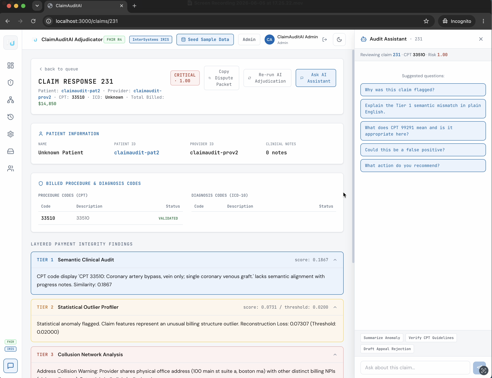
</p>

<p align="center">
  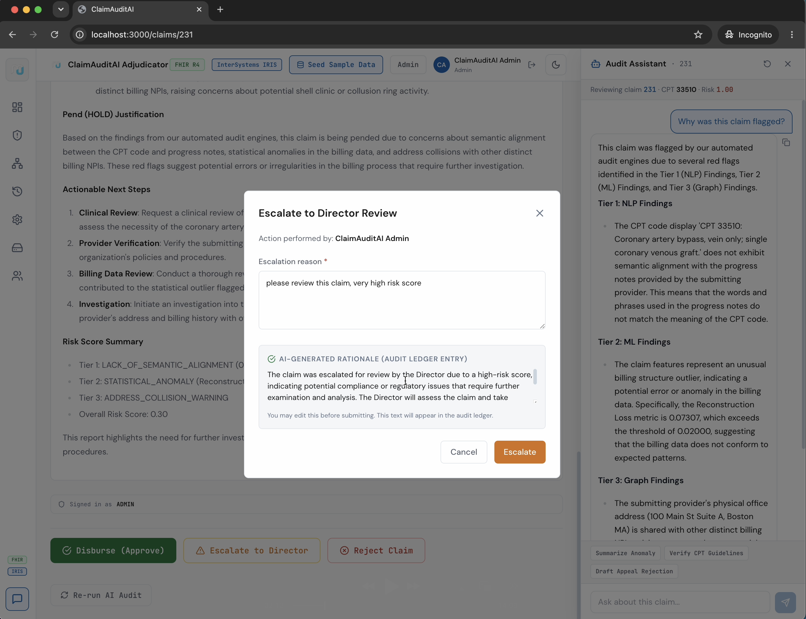
</p>

### 2. The 3-Tier AI Engine (`tier_orchestrator.py`)
AI evaluation runs within the database memory space using Embedded Python, running **sequentially** (not in parallel) to ensure thread-safety and database integrity in InterSystems IRIS. The orchestrator enforces a **circuit breaker** (default: 3 failures → 60s cooldown) and per-tier timeouts (Tier1=180s, Tier2=120s, Tier3=120s) to prevent cascading failures:
- **Tier 1 (NLP Similarity):** Cosine similarity between claim descriptions and progress notes via sentence-transformers in [nlp_auditor.py](src/python/nlp_auditor.py). Flags when best_similarity < 0.38 — CPT codes semantically distant from clinical documentation.
- **Tier 2 (ML Autoencoder Anomaly):** [autoencoder_train.py](src/python/autoencoder_train.py) trains an unsupervised PyTorch Autoencoder (8 input dimensions → 6 bottleneck). Reconstruction loss threshold is `max(95th_percentile, 0.02)`. Model retraining is secured with a **15% validation split** and a **15% validation drift threshold** to reject updates that degrade performance. Integrates rolling backups of the last 3 successful models (`_v1.pth/npz`, `_v2.pth/npz`, `_v3.pth/npz`) for instant rollback recovery. Model loading is backward compatible with legacy 5-dimensional models via dynamic feature slicing and padding. Requires ≥5 training claims; tier gracefully bypasses (not-flagged) when data is insufficient.
- **Tier 3 (Collusion Networks):** [graph_analyzer.py](src/python/graph_analyzer.py) builds an entity-relationship network of patient-provider connections. It runs localized 2-hop ego-network searches around target patients and providers using high-performance SQL queries rather than loading the entire network graph into memory, ensuring high speed and scalability. Graph cache is invalidated after each claim audit. Exception handler is fail-open — errors flag the claim for review, never silently suppress.

  <p align="center">
    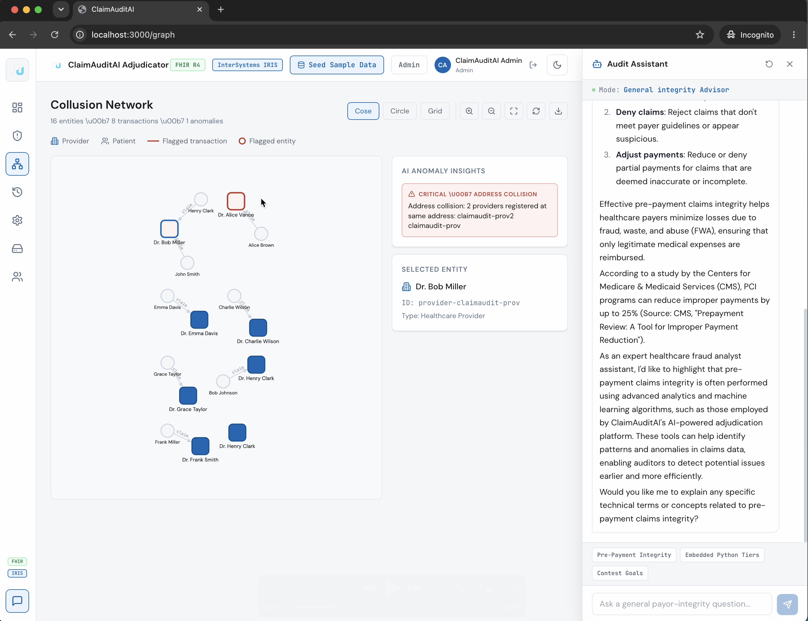
  </p>

- **Risk Scoring:** Tier 1 (+0.35) + Tier 2 (+0.35) + Tier 3 (+0.30), capped at 1.0. Score stored as FHIR ClaimResponse extension — the single source of truth read by all endpoints. Classification: ≥0.86→critical, ≥0.50→high, else→medium.

### 3. Asynchronous Adjudication Queue & Worker
To prevent slow AI pipelines (such as cloud LLM calls and complex vector similarity checks) from blocking real-time transactional HTTP ingestion threads:
1. **Deferral**: When a claim is intercepted, it is immediately assigned a unique reference ID, saved with a `queued` status, and added to the [ClaimAudit.Data.Queue](src/cls/ClaimAudit/Data/Queue.cls) table.
2. **Immediate HTTP Response**: The gateway returns a fast `202 Accepted` response to the client within milliseconds.
3. **Background Worker**: An asynchronous background job running inside the IRIS container (`StartWorker()` in [Engine.cls](src/cls/ClaimAudit/AI/Engine.cls)) polls the queue, executes the full Pydantic Graph FSM, generates the adjudication report, and updates the `ClaimResponse` resource status.
4. **On-Demand (JIT) Report Generation & Re-Adjudication**: Detailed LLM summaries are compiled on-demand (JIT) when an auditor views the claim detail, and re-audits can be manually triggered to execute asynchronously through the queue.

### 4. Medical Terminology MCP Server
To support real-time clinical code resolution and validation, ClaimAuditAI exposes a Model Context Protocol (MCP) server built with Python's FastMCP framework. This server runs alongside the main application and provides key JSON-RPC tools for medical terminology validation:
- **`lookup_cpt_code(code: str) -> str`**: Translates a 5-digit CPT code (e.g., `99214`) into its human-readable clinical procedure description.
- **`lookup_icd_code(code: str) -> str`**: Translates an ICD-10 diagnosis code (e.g., `I10`) into its clinical definition, supporting prefix matching.
- **`validate_diagnosis_procedure(icd_code: str, cpt_code: str) -> str`**: Invokes the diagnosis-procedure compatibility engine to check if a billed procedure is medically justified by the diagnosis.

The MCP server is implemented in [mcp_server.py](src/python/mcp_server.py) and delegates to [dx_procedure_validator.py](src/python/dx_procedure_validator.py), which maintains 13 ICD-10 chapter → CPT range validation rules (e.g., `F` prefix → psychiatric codes 90791–90899) and flags unsupported code combinations as potential upcoding.

The MCP server runs inside the `claimaudit-iris` Docker container, allowing seamless tool discovery and integration.

### 5. FHIR SQL Builder Projections
To enable high-performance relational queries across complex, nested FHIR JSON resource models, ClaimAuditAI integrates with the native InterSystems FHIR SQL Builder:
- **Projection Schema**: Maps resources to flat tables like `FHIRSQL.Claim` and `FHIRSQL.ClaimResponse` under the `FHIRSQL` schema.
- **`projections.json`**: Pre-configured mapping definitions in [projections.json](fhirsql/projections.json) can be imported directly into the Management Portal to instantiate projections.
- **SQL Helper Class**: [SQLBuilderHelper.cls](src/cls/ClaimAudit/FHIR/SQLBuilderHelper.cls) exposes registered methods to check projection table existence (`CheckProjectedTablesExist()`), retrieve claims (`QuerySQLBuilderClaim()`), and compute statistical indices (`GetProjectionStats()`).

### 6. Explainable AI (XAI) Citations
For auditing accountability, the ReAct agent graph and three-tier engines generate explicit trace citations for all pended findings:
- **Citations Array**: Every response payload gathers target resource identifiers (`Patient/<id>`, `DocumentReference/<id>`, `Claim/<id>`) in a top-level `"citations"` array.
- **Traceability**: If Tier 1 flags a CPT code because it lacks semantic notes alignment, the citation traces back to the specific `DocumentReference` containing the progress notes. If Tier 3 flags a collusion ring, it cites all the linked steering `Claim` resources. These citations are attached as custom FHIR extensions to the pended `ClaimResponse` resource, allowing auditors to inspect raw evidentiary source records.

---

## 🔒 Security & RBAC Model

The system enforces strict role-based access control (RBAC) across both API and database layers:

<p align="center">
  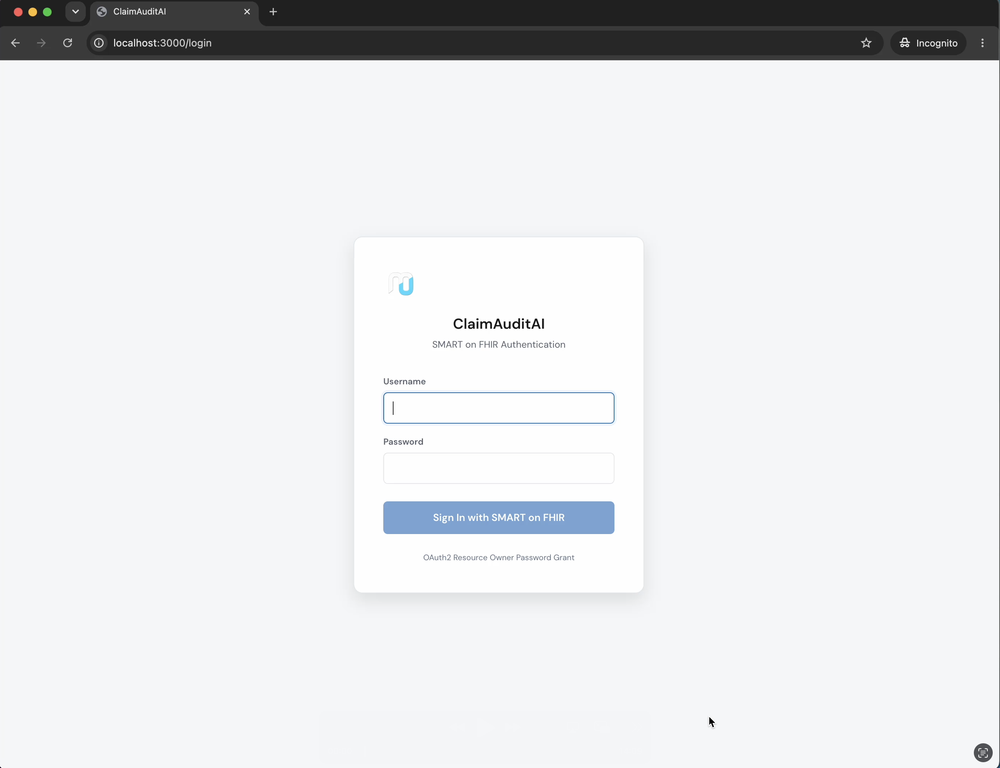
  &nbsp;&nbsp;&nbsp;&nbsp;
  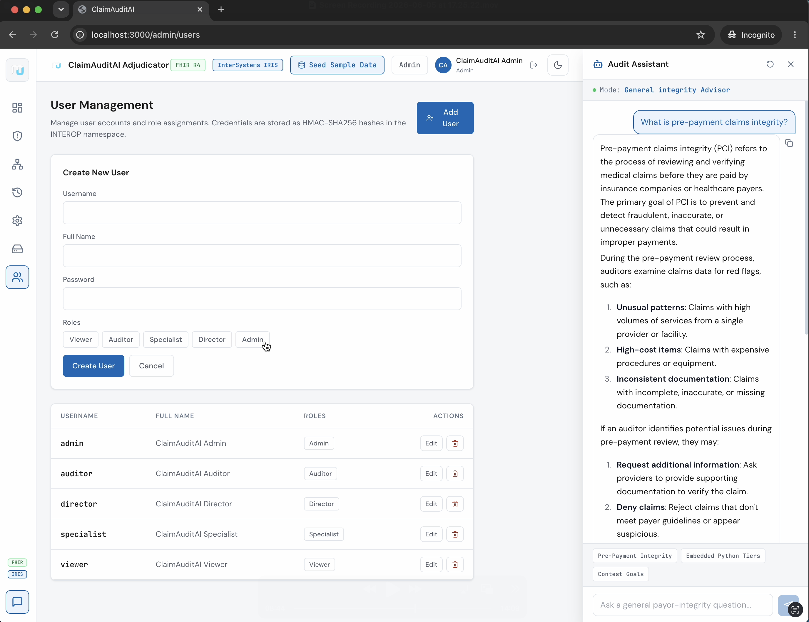
</p>

- **SMART on FHIR Authentication:** HS256 JWT tokens are issued against HMAC-SHA256 credential hashes stored in INTEROP-namespace globals (`^ClaimAuditAI("Users",...)`) — avoiding `%SYS` namespace access for CSP gateway requests. Tokens validated with `$SYSTEM.Encryption.HMACSHA(256, ...)` signature verification. Supports Keycloak RS256 JWKS for federated OIDC.
- **Key Caching & Hardening:** JWKS certificates cached locally for 1 hour. `JWT_SECRET` is expected in production mode. If missing, the system logs a security warning to the `^ClaimAuditSecurityError` global and falls back to a persistent GUID to ensure system accessibility during reviewer evaluations.
- **Role Hierarchy Gatekeeper:** The [Auth.cls](src/cls/ClaimAudit/REST/Auth.cls) middleware extracts roles from the JWT token and enforces a numeric hierarchy (Viewer=1, Auditor=2, Specialist=3, Director=4, Admin=5) on all protected endpoints. Roles read from INTEROP globals — no `$Roles` dependency on IRIS process identity.
  - **Auditor:** Reviews held claims, escalates anomalies.
  - **Specialist:** Conducts collusion graph analysis, manages second-stage overrides.
  - **Director:** Resolves escalated pended holds (Approve/Reject), authors ledger override summaries.
  - **Tech Owner / Admin:** Full settings administration, model retraining, and system purges.
- **Least-Privilege IRIS Hardening:** Web applications (`/api` and `/fhir/r4`) run under tightened MatchRoles parameters (`:%DB_INTEROP-CODE:%DB_INTEROP-DATA:%Admin_Secure`) instead of matching `%All` permissions.

---

## 🚀 Quick Start (Docker Environment)

### Prerequisites
- Docker & Docker Compose
- A modern browser (Chrome/Firefox/Safari)
- **An LLM Backend Provider (Local or Cloud):**
  - **Local:** Ollama running locally (recommended: `llama3.2:3b-instruct-fp16` (6.4 GB) or `granite4.1:3b-bf16` (6.8 GB)) accessible from the container.
  - **Cloud:** An API key for OpenAI, NVIDIA NIM, or **OpenRouter** (supports `google/gemini-2.5-pro` among other models), configured in the `.env` file.

### Setup & Run
1. Clone the repository and configure environments:
   ```bash
   git clone https://github.com/mainza-ai/ClaimAuditAi.git
   cd ClaimAuditAi
    cp .env.example .env
    # Edit .env: set LLM_PROVIDER (ollama/nvidia/openai), API keys, and JWT_SECRET
    ```
2. Build and launch the containers:
   ```bash
   docker compose up -d --build
   ```
3. Load and seed the extended sample FHIR data bundles:
   ```bash
    docker exec -it claimaudit-iris iris session IRIS -U INTEROP "##class(ClaimAudit.REST.Router).LoadSampleData()"
   ```

Open `http://localhost:3000` to access the dashboard.
- **Default Auditor Login:** `auditor` / `AuditReview2026!`
- **Default Admin Login:** `admin` / `ClaimAuditAdmin2026!`

---

## ⚙️ Operations, LLM Configuration & Diagnostics

For system administrators and operations teams, ClaimAuditAI provides dedicated configuration portals to configure LLM reasoning providers and inspect component health:

- **LLM Settings:** Dynamically select AI reasoning backends (e.g. OpenAI, NVIDIA NIM, Ollama) and configure model weights/temperatures.
- **Data Seeding & ML Retraining:** Reset the database, re-seed synthetic FHIR bundles, and retrain the PyTorch autoencoder directly from the dashboard.
- **Health Diagnostics:** Inspect running database and python component services.
- **Audit Ledger:** Maintain an immutable record of all claim overrides.

<p align="center">
  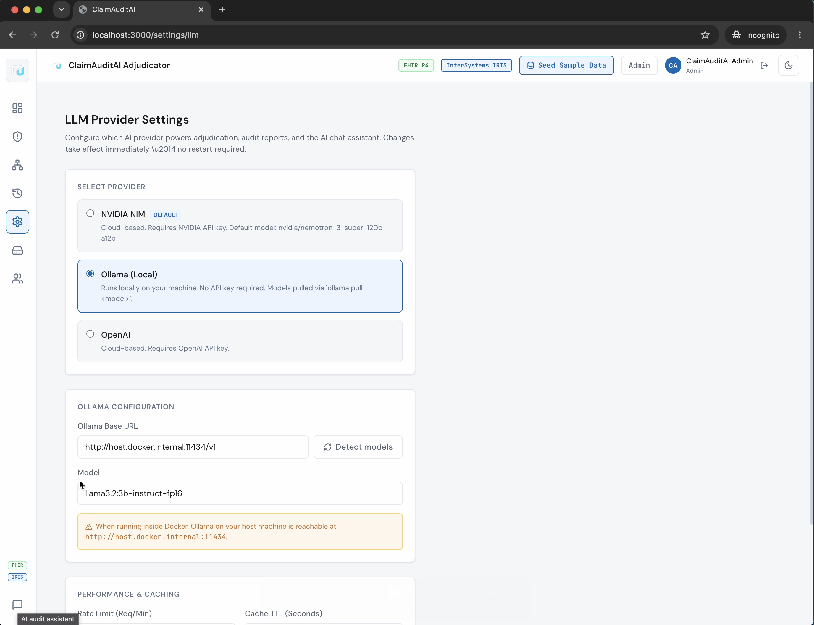
  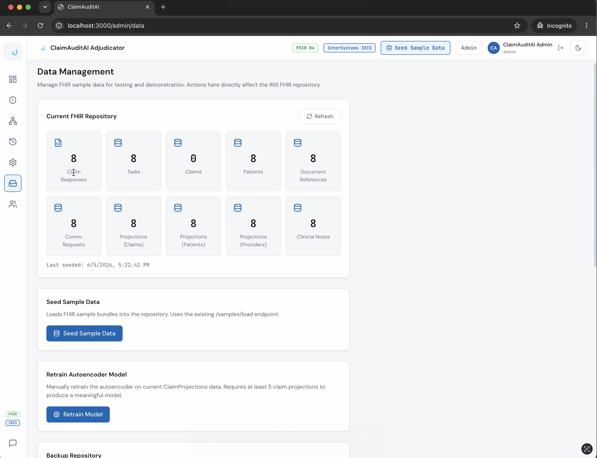
  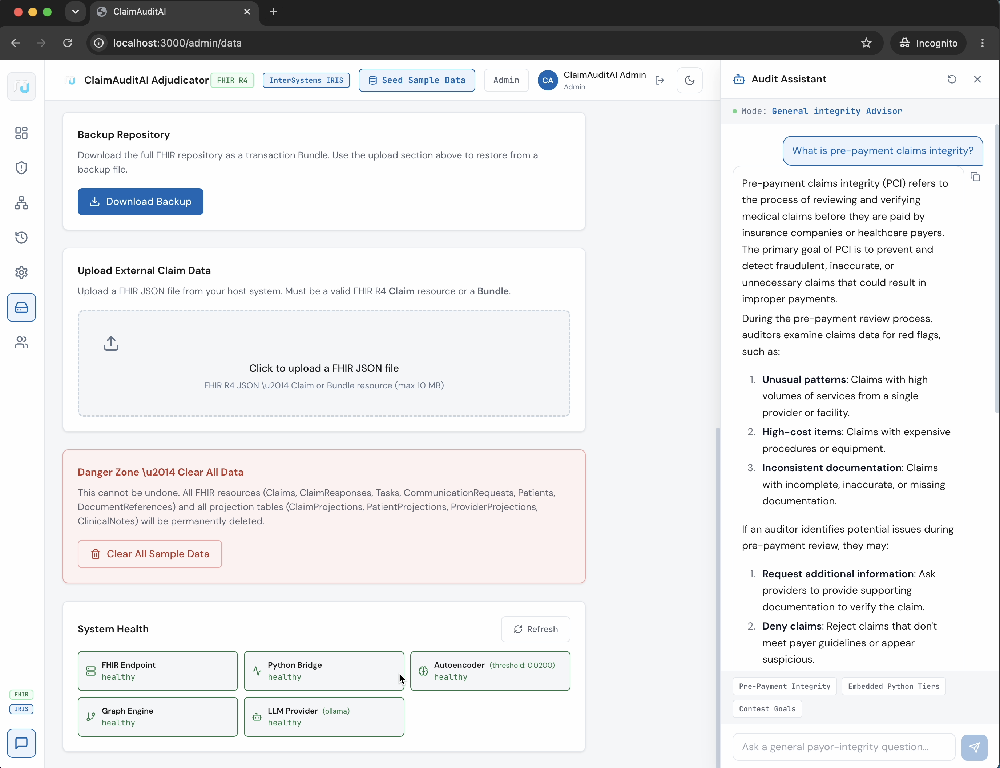
</p>

<p align="center">
  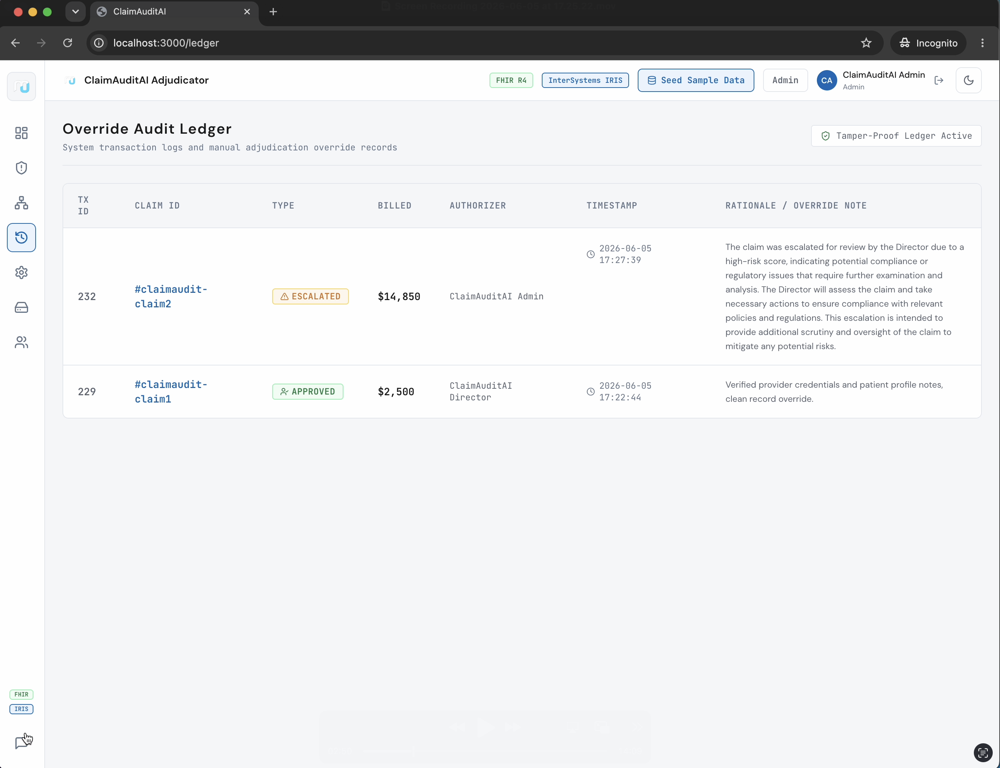
</p>

---

## 🔌 REST API Catalog

All protected endpoints require an `Authorization: Bearer <token>` header. Routes are organized by functional area:

**Authentication**
| Method | Path | Access | Purpose |
|:---|:---|:---|:---|
| `POST` | `/api/auth/login` | Public | Authenticates credentials and returns a signed JWT |
| `POST` | `/api/auth/introspect` | Public | SMART on FHIR token validation (RFC 7662) |
| `GET` | `/api/auth/debug` | Public | Decoded token info for debugging |

**Stats & Metrics**
| Method | Path | Access | Purpose |
|:---|:---|:---|:---|
| `GET` | `/api/stats` | Protected | Aggregated hold, complete, and value metrics |
| `GET` | `/api/stats/model-performance` | Protected | AI model precision/recall/F1 metrics (from ^ClaimAuditMLMetrics) |
| `GET` | `/api/metrics` | Protected | Prometheus-style system metrics |

**Claims Operations**
| Method | Path | Access | Purpose |
|:---|:---|:---|:---|
| `GET` | `/api/claims/held` | Protected | Paginated active hold queue |
| `GET` | `/api/claims/export` | Protected | CSV export of held claims |
| `GET` | `/api/claims/:id` | Protected | Detailed claim JSON with AI reason summaries |
| `POST` | `/api/claims/:id/approve` | Director+ | Approve override (writes to ledger, completes task) |
| `POST` | `/api/claims/:id/escalate` | Auditor+ | Progresses task status (Specialist → Director) |
| `POST` | `/api/claims/:id/reject` | Director+ | Reject claim (sets outcome to error, cancels task) |
| `POST` | `/api/claims/:id/reaudit` | Auditor+ | Re-run AI audit pipeline on a held claim |
| `POST` | `/api/claims/:id/generate-report` | Protected | JIT LLM adjudication report generation |
| `POST` | `/api/claims/summarize-rationale` | Protected | LLM summary of auditor decision rationale |

**Chat & AI Assistant**
| Method | Path | Access | Purpose |
|:---|:---|:---|:---|
| `POST` | `/api/chat` | Protected | AI audit assistant (provider-agnostic LLM) |
| `POST` | `/api/chat/stream` | Protected | SSE streaming chat response |
| `GET` | `/api/chat/history/:id` | Protected | Retrieve chat history for a claim |
| `POST` | `/api/chat/history/:id` | Protected | Save a chat message for a claim |

**Ledger & Graph**
| Method | Path | Access | Purpose |
|:---|:---|:---|:---|
| `GET` | `/api/ledger` | Protected | Paginated override audit ledger log |
| `GET` | `/api/graph` | Protected | Cytoscape network graph data (from ^ClaimAuditGraph globals) |

**FHIR & Settings**
| Method | Path | Access | Purpose |
|:---|:---|:---|:---|
| `GET` | `/api/fhir/metadata` | Public | FHIR server capability statement |
| `GET` | `/api/settings/llm` | Admin | Query current LLM provider settings |
| `POST` | `/api/settings/llm` | Admin | Update LLM provider, model, API keys, rate limit, cache TTL |
| `GET` | `/api/settings/llm/ollama/models` | Admin | List available Ollama models |

**System & Administration**
| Method | Path | Access | Purpose |
|:---|:---|:---|:---|
| `GET` | `/api/system/status` | Admin | System health overview (models, indexes, queue) |
| `GET` | `/api/system/health` | Admin | Component-level health check |
| `POST` | `/api/system/clear` | Admin | Clear all FHIR tables and graph data |
| `POST` | `/api/system/upload` | Admin | Upload FHIR bundle from JSON payload |
| `POST` | `/api/system/backup` | Admin | Download full FHIR repository as transaction Bundle |
| `GET` | `/api/system/admin-log` | Admin | Admin audit trail (paginated) |
| `POST` | `/api/system/retrain-model` | Admin | Retrain PyTorch autoencoder on current projections |
| `POST` | `/api/system/backfill-tier-results` | Admin | Backfill tier-results extension for existing ClaimResponses |
| `POST` | `/api/samples/load` | Admin | Clears tables and re-seeds synthetic FHIR data (8 claims) |
| `GET` | `/api/system/users` | Admin | List all system users |
| `POST` | `/api/system/users` | Admin | Create user |
| `PUT` | `/api/system/users/:username` | Admin | Update user (roles, password, full name) |
| `DELETE`| `/api/system/users/:username` | Admin | Delete user (prevents removing last admin) |
| `GET` | `/api/admin-test` | Admin | Simple admin route reachability test |

---

## 🧪 Testing & Verification

Comprehensive verification suites validate both client and server layers.

### 1. Python Unit Tests (`pytest`)
Contains 101 test cases verifying NLP calculations, PyTorch training/inference anomaly outputs with validation/drift safeguards, NetworkX network cycles, agent/tool state machine transitions, and Model Context Protocol (MCP) server endpoints:
```bash
# Inside the container (or local environment with virtualenv)
pytest src/python/tests/ -v
```

### 2. Frontend Unit & Store Tests (`Vitest`)
Runs 18 test cases checking React components, rendering states, and Zustand stores:
```bash
cd ui
npm run test
```

### 3. Real-World End-to-End Integration Tests (Host to Docker)
To verify the complete payment integrity workflow against the live, dockerized application services from the host, execute the E2E script:
```bash
# From the project root on the host machine
.venv/bin/python scratch/real_world_e2e_tests.py
```
This automated script executes a full transaction verification suite:
* **Persona Authentication:** Logs in as Admin, Auditor, and Director using SMART on FHIR tokens.
* **Auto-healing User Registration:** Dynamically seeds missing roles (`director`, `specialist`) via the Admin API.
* **Fast Database Purge & Seed:** Resets all FHIR tables and seeds the 8 anomalous claims (using the `Seeding` LLM bypass to prevent HTTP connection timeouts).
* **Autoencoder Training:** Triggers the PyTorch autoencoder model retraining on the fresh projections.
* **JIT Adjudication Reports:** Queries the detail page of a held claim, which dynamically triggers the LLM on-demand (JIT) to generate a detailed explainable report and persists it to the database.
* **Auditor Escalation & Director Approval:** Escalates a pended claim to Director review and overrides/approves it.
* **Collusion Graph Insights:** Verifies the NetworkX-generated collusion graph and address-collision detection.
* **Health & Logs Diagnostic:** Audits the component health status and checks admin log entries.
* **FHIR Repository Backup:** Downloads a full backup bundle of the FHIR repository.

### 4. End-to-End Browser Tests (`Playwright`)
Simulates user behavior covering login, sidebar routing, sample data seeding, and hold queue approval cycles:
```bash
cd ui
npm run test:e2e
```

### 5. CI/CD Integration
A GitHub Actions workflow ([ci.yml](.github/workflows/ci.yml)) automates quality gates on every push/PR:
- Linters & Types (`eslint`, `tsc --noEmit`)
- Python test suite & Vitest coverage exports
- Production asset compilation verification

---

## 📘 Detailed Documentation
- Visit the [Comprehensive Wiki Pages](claimauditai-wiki/00-index/ClaimAuditAI%20Home.md) for deeper information on ML models, FHIR structures, setup guides, and troubleshooting recipes.

---

## 🖼 Project Presentation & Pitch Slide Deck

The following slideshow walks through the business motivation, technical architecture, and implementation details of ClaimAuditAI. Click to expand and view the slides.

<details>
<summary>📂 View Slide Presentation (15 Slides)</summary>

### Slide 1: Title
<p align="center">
  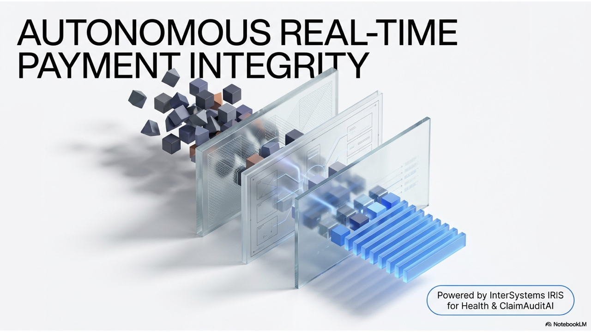
</p>

### Slide 2: The Pre-Payment Payment Integrity Problem
<p align="center">
  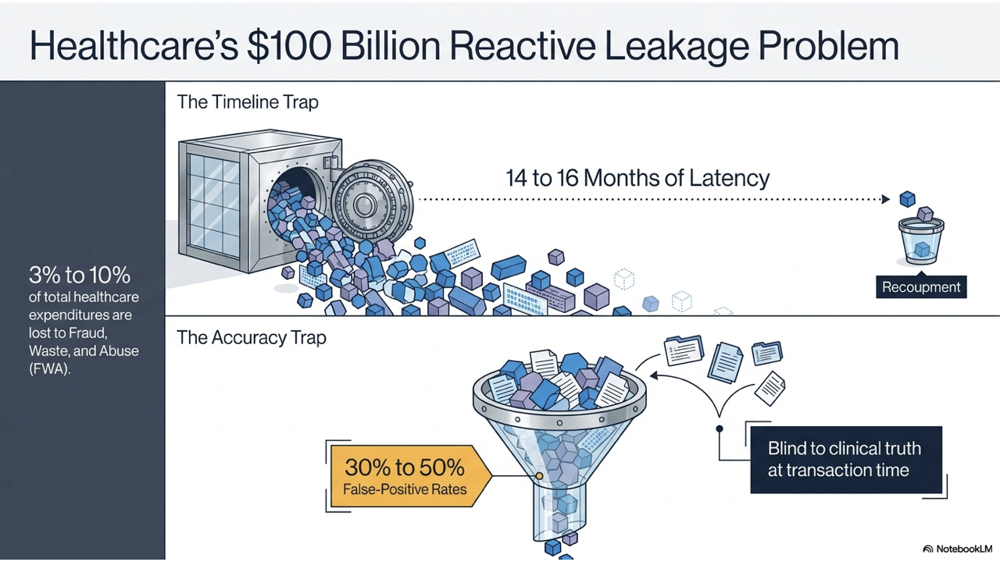
</p>

### Slide 3: The ClaimAuditAI Solution
<p align="center">
  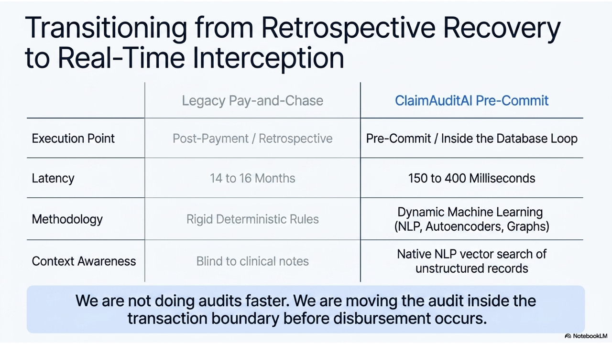
</p>

### Slide 4: Sequential 3-Tier AI Architecture
<p align="center">
  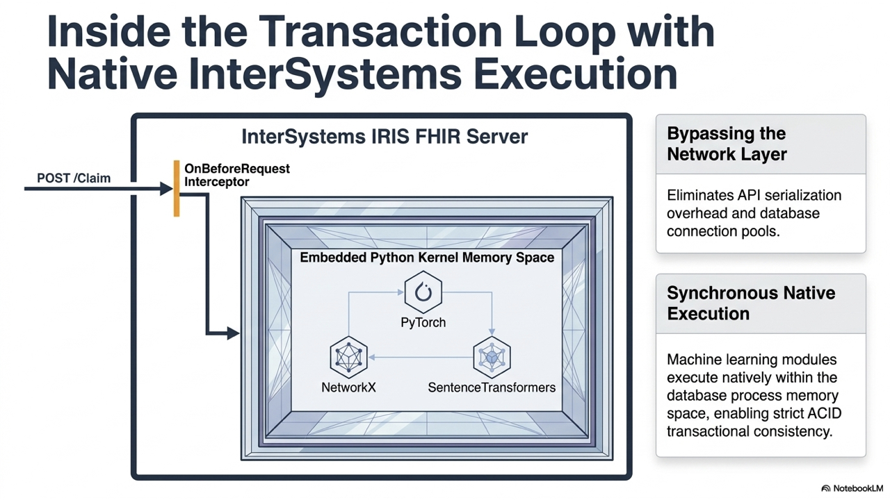
</p>

### Slide 5: Tier 1 - Clinical Note NLP Analysis
<p align="center">
  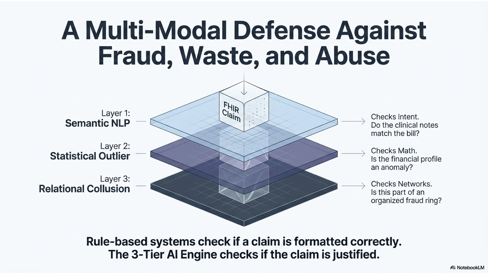
</p>

### Slide 6: Tier 2 - PyTorch Autoencoder Anomaly Detection
<p align="center">
  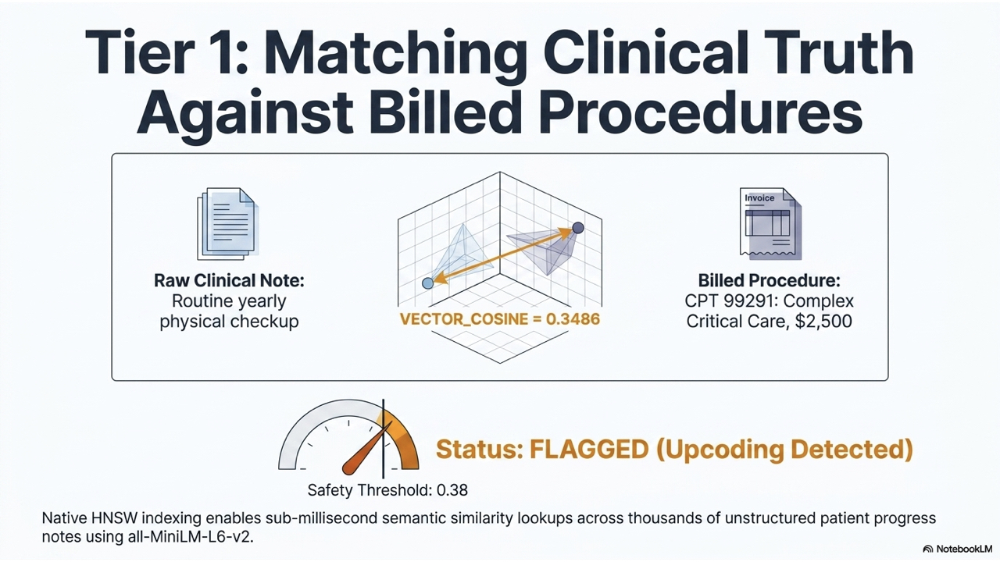
</p>

### Slide 7: Tier 3 - NetworkX Collusion Network Graph
<p align="center">
  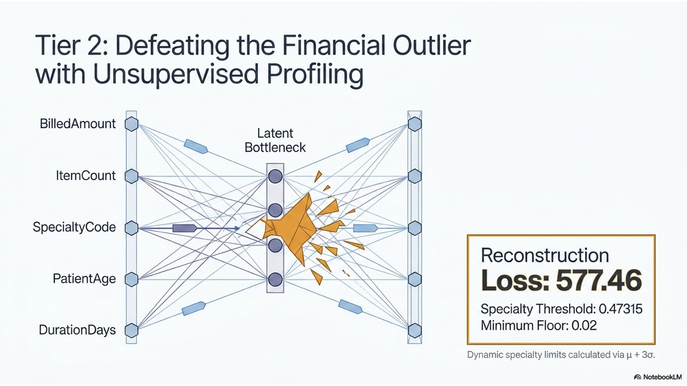
</p>

### Slide 8: Real-Time FHIR Interception Hooks
<p align="center">
  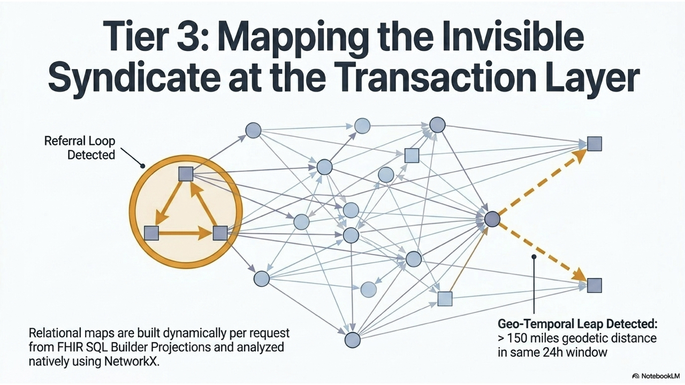
</p>

### Slide 9: SMART on FHIR Role-Based Access Control
<p align="center">
  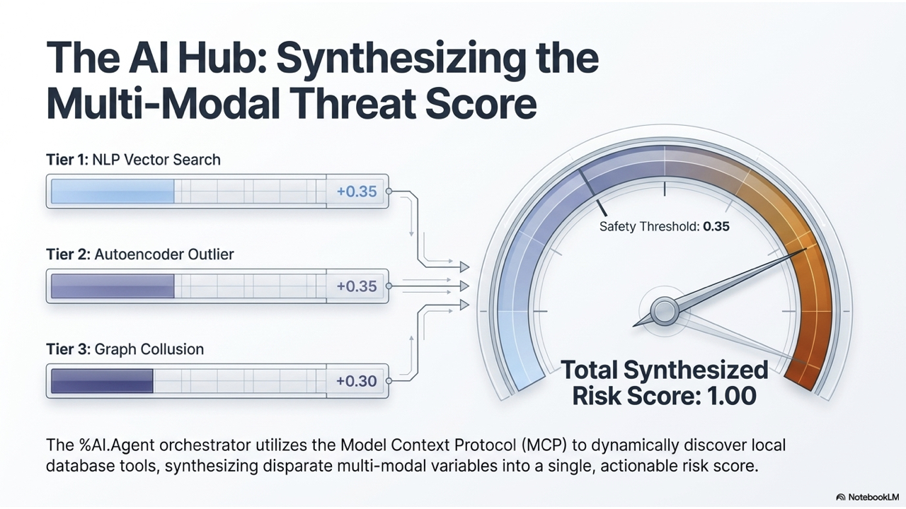
</p>

### Slide 10: Auditor Worklist and AI Copilot
<p align="center">
  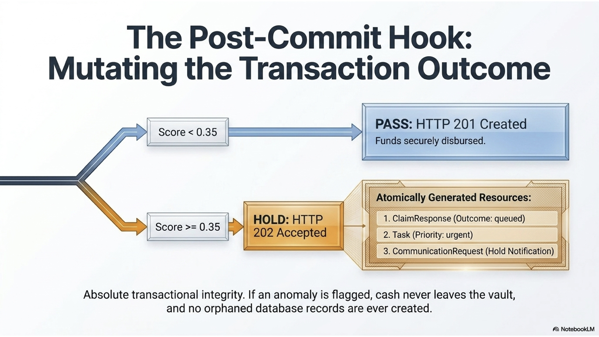
</p>

### Slide 11: Tamper-Proof Decision Override Ledger
<p align="center">
  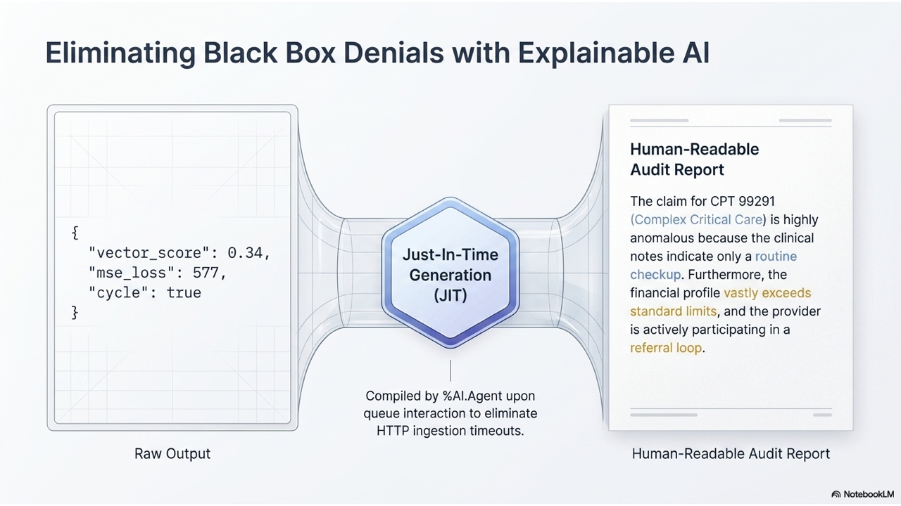
</p>

### Slide 12: Production-Grade Reliability & Safeguards
<p align="center">
  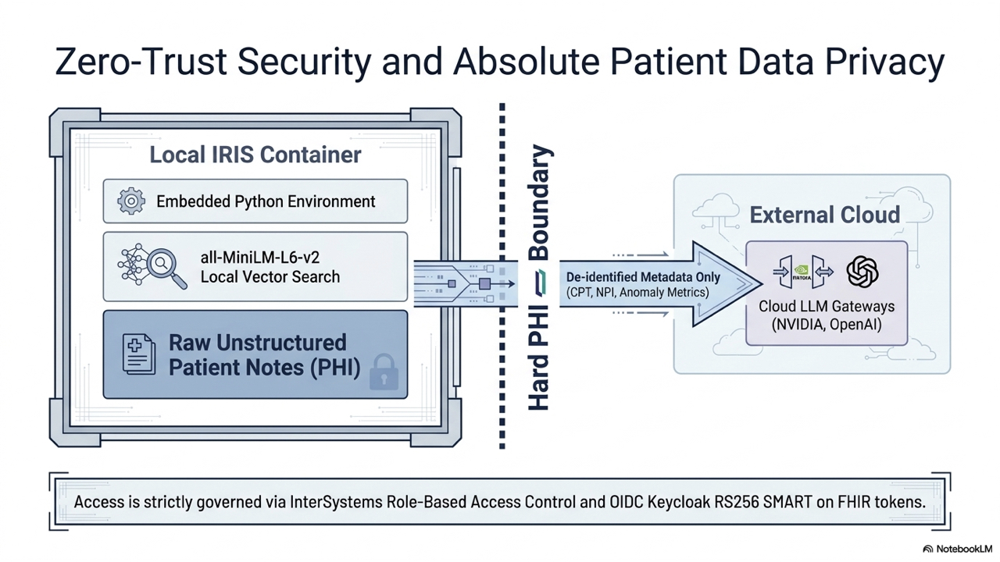
</p>

### Slide 13: Core Technical Stack & Performance
<p align="center">
  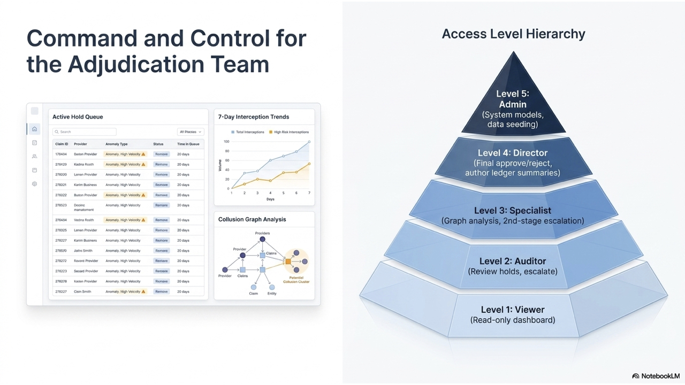
</p>

### Slide 14: Future Roadmap & Integration
<p align="center">
  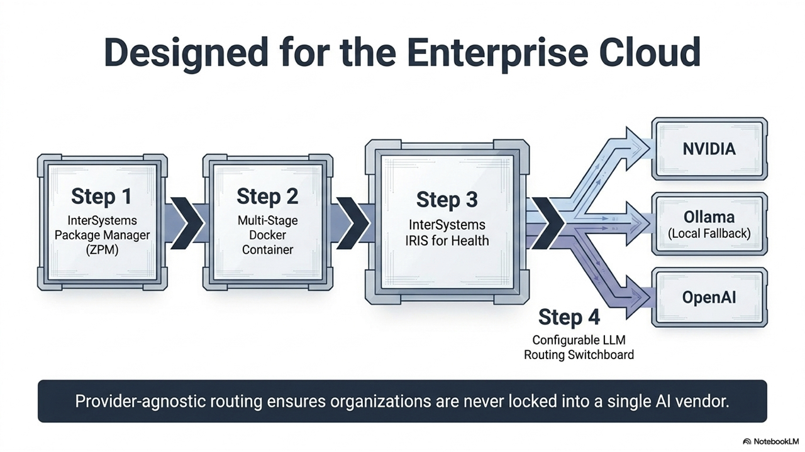
</p>

### Slide 15: Conclusion & Contact Info
<p align="center">
  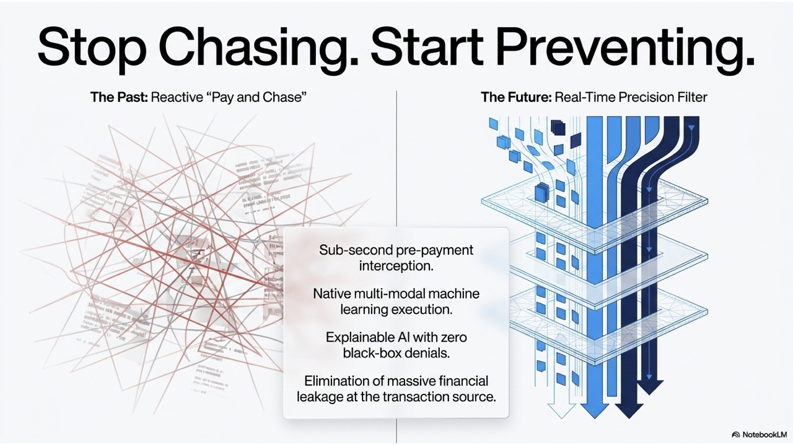
</p>

</details>

---

## 📄 License
Released under the [MIT License](LICENSE).

