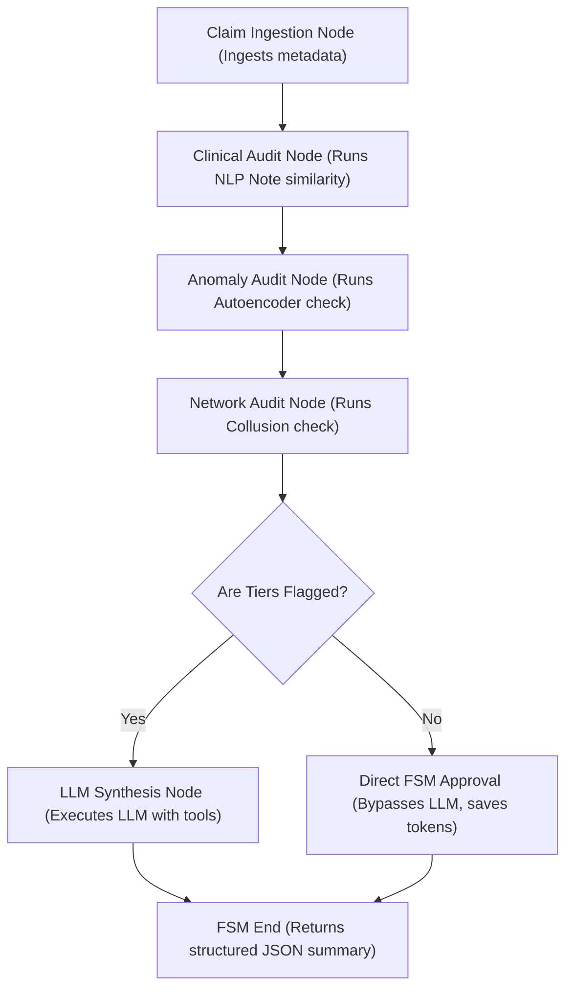

# Orchestration - AI Hub & Agentic FSM

> The orchestration layer coordinates payment integrity decisions by running a compiled Finite State Machine (FSM) via Pydantic Graph, with native InterSystems AI Hub integrations.

ClaimAuditAI utilizes a hybrid orchestration approach. The database triggers audits via a wrapper class `ClaimAudit.AI.AgentWrapper`, which checks for the presence of native InterSystems AI Hub classes (`%AI.Agent`, `%AI.ToolSet`, `%AI.Tool`). If present, it leverages AI Hub for orchestration. Otherwise, it dispatches to the Embedded Python layer to execute a type-safe **Pydantic Graph** FSM.

## Pydantic Graph FSM Pipeline

The FSM (defined in `agent_graph.py` and run via `agent_orchestrator.py`) organizes the auditing pipeline into a series of type-safe node executions with strict state-type validation:

### FSM Nodes & State Management:
- **State Object (`AuditState`)**: Tracks inputs, intermediate tier results, citations, and the final adjudication payload.
- **`ClaimIngestionNode`**: Validates the claim input metadata.
- **`ClinicalAuditNode`**: Executes semantic clinical note validation (CPT vs narrative matching).
- **`AnomalyAuditNode`**: Scores claim financials against the trained autoencoder.
- **`NetworkAuditNode`**: Inspects referral loop and address collisions on the provider network.
- **`LLMSynthesisNode`**: Consolidates results. If the claim is clean, it returns an approval immediately. Otherwise, it invokes the structured LLM chat pipeline with tools to compile an explanation and next steps.

### Just-In-Time (JIT) Generation & Seeding Bypass
Because generating detailed LLM summaries synchronously can take 10-25 seconds and lead to HTTP gateway connection timeouts (e.g. 504 Gateway Timeout) during bulk ingestion or database seeding:
1. **Seeding Bypass:** A process-level `^ClaimAuditAI("Seeding")` flag is enabled during bulk sample loading (`/api/samples/load`). The FHIR interceptor skips the slow LLM generation calls for seeded anomalous claims, storing only the basic reason strings. This cuts database loading down from 100+ seconds to under 2 seconds.
2. **On-Demand (JIT) Compilation:** When an auditor or E2E script opens the detail page for a pended claim (`GET /api/claims/:id`), the server detects the basic hold summary and invokes `GenerateHoldSummary` on-demand (just-in-time). The fully synthesized LLM report is then updated on the `ClaimResponse` resource (`PUT`) and cached in the database for subsequent instant loads.

## Key Details
- **Core Orchestrator**: `ClaimAudit.AI.AgentWrapper` bridging native InterSystems `%AI.Agent` and the Python Pydantic Graph FSM.
- **State-based Nodes**: Strictly typed FSM execution nodes with `StepContext[AuditState, None, str]` bindings.
- **Score Synthesis**: Tier 1 (NLP) +0.35, Tier 2 (Autoencoder) +0.35, Tier 3 (Graph) +0.30, capped at 1.0. Score stored as FHIR ClaimResponse extension.
- **Threshold Limit**: Combined threat score $\ge 0.35$ triggers a hold status.
- **Language Models**: Provider-agnostic routing via `llm_router.py` — supports `nvidia`, `ollama`, `openai`, and `openrouter` backends. Uses `openai==2.41.0` library with `httpx>=0.28.1`. RETRY_COUNT=3 with exponential backoff; rate-limit check inside retry loop.

## Tier Orchestration & Circuit Breaker

Tiers are executed **sequentially** (not in parallel) by `tier_orchestrator.py` to ensure transactional safety in InterSystems IRIS Embedded Python. Each tier has a configurable timeout:

| Tier | Module | Timeout |
|:---|:---|:---:|
| 1 (NLP Clinical) | `nlp_auditor` | 180s |
| 2 (Autoencoder) | `autoencoder_train` | 120s |
| 3 (Graph Collusion) | `graph_analyzer` | 120s |

If a tier times out, it flags the claim for manual review rather than failing silently.

A **circuit breaker** protects the system from repeated failures:
- `CIRCUIT_THRESHOLD = 3` — opens after 3 consecutive failures in a tier
- `CIRCUIT_RESET_SECONDS = 60` — cooldown before attempting that tier again
- While open, the tier returns a safe fallback result without calling the analysis engine

## Chat Streaming Architecture

The `/api/chat/stream` endpoint uses **simulated Server-Sent Events (SSE)**:
1. ObjectScript sets SSE headers (`Content-Type: text/event-stream`, `Cache-Control: no-cache`, `Connection: keep-alive`, `X-Accel-Buffering: no`)
2. Calls the Python agent (`llm_router.run_chat_agent()`) — a non-streaming ReAct loop with tool access
3. After the full response returns, ObjectScript chunks it into 80-character pieces, wraps each in `{"chunk": "..."}` JSON, and emits SSE `data:` events
4. Client receives progressive chunks via EventSource

The underlying Python `llm_router.chat_stream()` generator does support true token-by-token streaming, but the current ObjectScript integration uses the buffered approach for compatibility with the agentic tool-calling loop.

## See Also
[[Three-Tier AI Engine Overview]] · [[ClaimResponse - HOLD vs Pass]] · [[VECTOR_COSINE Query Pattern]]