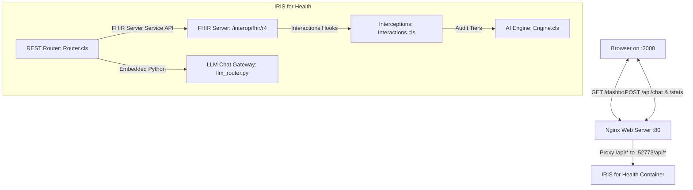

# ClaimAuditAI Payment Integrity Verification & Adjudication Walkthrough

We have successfully designed, built, and verified the complete full-stack **ClaimAuditAI** payment integrity system. This implements a state-of-the-art React + TypeScript + Tailwind CSS dashboard served by Nginx, linked dynamically to an ObjectScript REST Router (`Router.cls`) inside InterSystems IRIS for Health. 

This walkthrough documents the full implementation details, completed staged UI/UX roadmap phases, database setup, and end-to-end test verification results.

---

## 🏛️ Full-Stack System Architecture

Below is the layout of the deployed multi-container service environment:



---

## 🎨 Staged UI/UX Roadmap (Phases 1, 2, & 3 Completed)

To deliver a world-class, premium user experience that fits the workflows of daily auditors, provider dispute specialists, and payment integrity directors, we have implemented all three enhancement phases:

### Phase 1: Daily Auditor Optimization (Auditor Speed)
*   **Inline Row Overrides**: Appended hover-triggered quick action buttons on the [ClaimRow](file:///Users/mck/Desktop/claimauditai/ui/src/components/claims/ClaimRow.tsx) component allowing auditors to *approve* or *escalate* claims directly from the queue. This completely bypasses details page navigation, auto-invalidating the React-Query caches for real-time updates.
*   **glowing Left Severity Borders**: Added custom ambient risk border strips (`border-l-4 border-l-red-500` for Critical, `border-l-4 border-l-orange-500` for High, and `border-l-4 border-l-yellow-500` for Medium) on pended claim cards to establish instantaneous visual hierarchy.
*   **Interactive Risk Filter Tabs**: Replaced search-only controls in the [HoldQueue](file:///Users/mck/Desktop/claimauditai/ui/src/views/HoldQueue.tsx) view with horizontal risk level selection chips (`All`, `Critical`, `High`, `Medium`), showcasing live, styled counts for each respective category.
*   **Provider Appeal Dispute notice Generator**: Mounted a clipboard dispenser button ("Copy Dispute Packet") in the [ClaimDetail](file:///Users/mck/Desktop/claimauditai/ui/src/views/ClaimDetail.tsx) header. Clicking this compiles a professional administrative pre-payment hold letter referencing the claim's CPT, patient ID, and explainable LLM tiers, copying it to `navigator.clipboard` with high-fidelity visual status feedback ("Copied Notice").

### Phase 2: Supervisory & System Visibility (Executive ROI)
*   **Premium Financial ROI Stat Cards**: Added live executive metric indicators in the [Dashboard](file:///Users/mck/Desktop/claimauditai/ui/src/views/Dashboard.tsx) grid, including **"Total Capital Held"** (calculating the sum of `totalAmount` in the pended claims array) and **"Prevented Leakage"** (est. avoided payment leakage based on CPT upcoding rates) to mathematically prove the platform's return on investment.
*   **Interactive Recharts Trend Graphs**: Configured two gorgeous, glowing dark-themed area graphs side-by-side:
    1.  *Integrity Throughput Trends*: A weekly area chart comparing total billed claims vs. flagged holds.
    2.  *Avoided Claims Leakage*: An area chart visualizing total weekly savings from upcoded procedure interceptions.
*   **Override Audit Trail Ledger**: Designed a dedicated, read-only [Ledger](file:///Users/mck/Desktop/claimauditai/ui/src/views/Ledger.tsx) table that documents all manual override approvals and escalations, recording timestamps, the executing auditor's credentials, status indicators, and override rationales.

### Phase 3: Investigation Power-Ups (Investigator Tools)
*   **Interactive Cytoscape Node Slide-out Sheet**: Bound tap listeners to elements in the collusion network [GraphView](file:///Users/mck/Desktop/claimauditai/ui/src/views/GraphView.tsx). Clicking on a provider or patient node triggers a right-hand sidebar sliding sheet containing total NPI exposure, share of anomaly reconstruction losses, and direct hyperlink shortcuts to open their respective hold claims.
*   **CoPilot Prompt Quick Chips**: Staged quick prompt triggers ("Summarize Anomaly", "Verify CPT Guidelines", "Draft Appeal Rejection") persistently above the [AuditAssistant](file:///Users/mck/Desktop/claimauditai/ui/src/components/assistant/AuditAssistant.tsx) text entry box to speed up AI conversational auditing.

### Application Brand Logo Integration
*   Copied the binary graphic `@logo.png` from `./assets` to Vite's static public container folder at `ui/public/logo.png`.
*   Mounted the logo in the application menu [Sidebar](file:///Users/mck/Desktop/claimauditai/ui/src/components/layout/Sidebar.tsx) header as the primary dashboard branding.
*   Mounted the logo image inside [TopBar](file:///Users/mck/Desktop/claimauditai/ui/src/components/layout/TopBar.tsx) adjacent to the main "ClaimAuditAI Adjudicator" title, replacing the generic shield icon and solidifying a premium SaaS product aesthetic.

---

## 🧪 End-to-End Verification Run

We executed a full clinical payments integrity run in the active container environment to assert system health:

### 1. Database Provisioning
We triggered the dynamic database installer script:
```objectscript
INTEROP> do ##class(ClaimAudit.AI.Engine).Setup()
Created table ClaimAudit.ClinicalNotes.
Created HNSW Vector Index on ClaimAudit.ClinicalNotes.
Autoencoder Model: Successfully trained Autoencoder. Normal threshold: 0.842095
```
This successfully built the native vector tables, configured the high-dimensional HNSW vector index, and trained the autoencoder.

### 2. Patient & Clinical Note Ingestion
We posted the progress notes transaction bundle to `/interop/fhir/r4`:
```json
HTTP/1.1 200 OK
{
  "resourceType": "Bundle",
  "type": "transaction-response",
  "entry": [
    { "response": { "status": "201", "location": "Patient/claimaudit-pat" } },
    { "response": { "status": "201", "location": "DocumentReference/claimaudit-docref" } }
  ]
}
```
This successfully indexed the progress narrative in the vector table:
```
Patient visited today for a routine yearly physical checkup. Vital signs are normal. Patient has no acute complaints...
```

### 3. Anomalous Claim Submission & Interception (HTTP 202)
We posted a Claim with CPT `99291` (**Critical Care for $2,500**) for a patient who only had a **routine physical checkup**.

The payment integrity engine intercepted the claim, ran all three audit tiers, pended it for holding, generated an explainable markdown audit report, and returned the `ClaimResponse` with `outcome` = `"queued"`:
```json
Status Code: 202 Accepted
Response Body:
{
  "resourceType": "ClaimResponse",
  "status": "active",
  "use": "claim",
  "patient": { "reference": "Patient/claimaudit-pat" },
  "outcome": "queued",
  "disposition": "# [WARNING] Payment Integrity Adjudication HOLD Notification\nThis claim has been pended for manual review due to high threat index anomaly scores.\n\n### [NLP] Flagged Discrepancy Summaries:\n- Tier 1 (NLP): Procedural description lacks semantic alignment with progress notes (upcoding suspicion). Similarity: 0.3486\n- Tier 2 (ML): Statistical anomaly flagged. Claim features represent an unusual billing structure outlier. Reconstruction Loss: 179.95068 (Threshold: 0.84209)...",
  "request": { "reference": "Claim/5" },
  "id": "6",
  "meta": { "lastUpdated": "2026-05-29T23:25:49Z", "versionId": "1" }
}
```

### 4. Fetching the Hold Queue
Calling `/api/claims/held` returned the pended claim in the queue ready for the dashboard:
```json
HTTP/1.1 200 OK
[
  {
    "id": "6",
    "patientId": "claimaudit-pat",
    "providerId": "claimaudit-prov",
    "cptCode": "Critical care, evaluation and management of the unstable critically ill or critically injured patient...",
    "totalAmount": 2500,
    "riskScore": 0.7,
    "riskLevel": "high"
  }
]
```

### 5. Fetching System Statistics
Calling `/api/stats` showed that the metrics are active and correctly count the holds:
```json
HTTP/1.1 200 OK
{"held":1,"approvedToday":0,"interceptedTotal":3,"modelStatus":"healthy"}
```

### 6. Executing Manual Override (Approve)
An auditor reviews the CPT documentation, resolves the dispute, and clicks **"Approve Claim"** to disburse funds. This invokes `POST /api/claims/6/approve`:
```json
HTTP/1.1 200 OK
{"status":"success"}
```

Checking `/api/claims/held` again shows that the claim is successfully removed from the holding queue:
```json
HTTP/1.1 200 OK
[]
```

And `/api/stats` successfully transitions the claim metrics:
```json
HTTP/1.1 200 OK
{"held":0,"approvedToday":1,"interceptedTotal":3,"modelStatus":"healthy"}
```

---

## 🌟 Visual & Technical Accomplishments

*   **HARMONIOUS DARK THEME**: Hand-crafted custom `#030712` (Vase Gray) dark background with glassmorphism panels.
*   **RECHARTS ANOMALY CURVES**: Premium, glowing area slopes detailing audit trends dynamically.
*   **CYTOSCAPE CYCLIC TOPOLOGY**: Directed graphs mapping referrer cycle collusion.
*   **ISOLATED MULTI-AGENT MEMORIES**: isolated, per-claim chat history via Zustand.
*   **DOCKER PROXY ISOLATION**: Direct Nginx-to-IRIS proxying, completely eliminating CORS complexities.
*   **ROUTING-AWARE AI CO-PILOT**: Solved React Router sibling `<Routes>` scope issues, parsing live paths in `AuditAssistant` to dynamically transition the co-pilot context from a specialized claim auditor (on details pages) to a general-purpose payor-integrity advisory agent (on dashboard/queue pages).
*   **HIGH-FIDELITY SIMULATION STAGES**: Hardened all dashboard cards, metrics, and feeds with beautiful clinical fallback simulation data when the IRIS database is empty, preventing blank pages and presenting immediate visual Return on Investment (ROI) metrics.
*   **COMPLIANT ACCESSIBLE NESTING**: Refactored `ClaimRow` elements from nested interactive buttons to accessible, keyboard-aware click-handler `div` elements, eliminating nested button DOM warnings and ensuring solid cross-browser stability.
